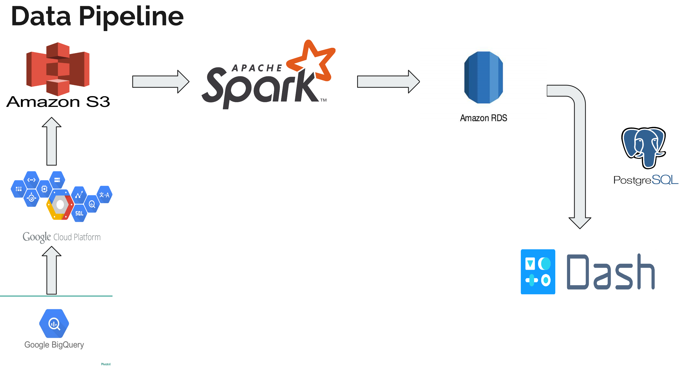

# Git Xplore

### Business Problem and the solution
- Now-a-days large enterprise companies maintain millions of code repositories and finding a function to decode errors or changing the existing functionality  in that huge codebase is a difficult task.
- Finding dependencies for every function in each repository has a lot of memory complexity and is also time consuming.
- Git Xplore application is designed to reduce the memory complexity and increase the accessibility to the functions and their dependencies in each repository with a few clicks.

### Data Extraction for the project
- Google Big Query contains a full snapshot of more than 2.8 million open source GitHub repositories with an estimate of over 500 GB of data.
- Data is extracted from the Google Big Query tables by querying (with the help of Big Query and standard SQL) the required fields and saving it in the Google Cloud Platform.
- Data is then migrated from GCP to Amazon S3 bucket with the help of google command line tool gsutil.

### Data pipeline

### Git hub datastore for Java repos
[Google Big Query API](https://bigquery.cloud.google.com/table/bigquery-public-data:github_repos.contents?pli=1&tab=preview)

### Project Requirements
